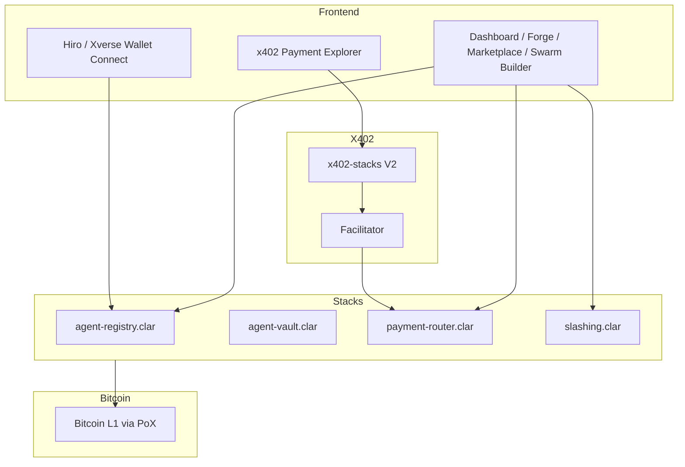
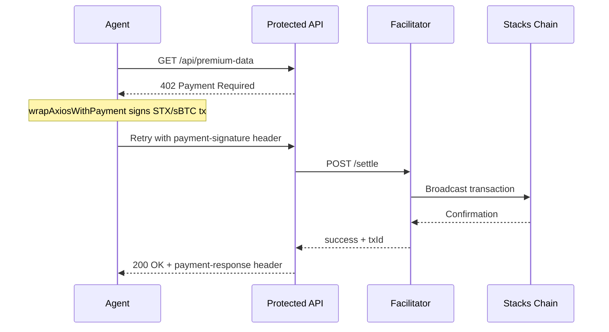
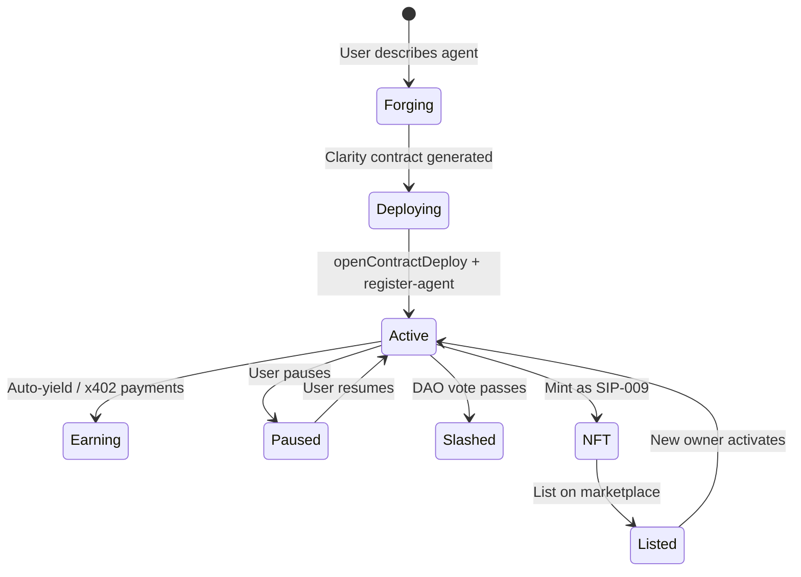

# Autonoma BTC

> **The Bitcoin-Native AI Agent Operating System on Stacks**
>
> Natural language → deploy unstoppable AI agent swarms that earn, spend, and collaborate in sBTC/USDCx using native Clarity smart contracts and x402 micropayments.

[](https://stacks.co)
[](https://docs.stacks.co/clarity)
[](https://github.com/coinbase/x402)
[](LICENSE)

---

## What is Autonoma BTC?

Autonoma BTC is a decentralized AI agent operating system built on Bitcoin via Stacks. It lets anyone deploy autonomous AI agents that:

- **Earn** — auto-optimize sBTC/USDCx yield across Bitflow and lending protocols
- **Pay** — autonomously pay for APIs, data, and compute via x402 micropayments (HTTP 402 protocol)
- **Collaborate** — form swarms where agents hire and pay each other for complex multi-step tasks
- **Self-govern** — stake sBTC as collateral, get slashed by DAO vote for bad behavior
- **Trade as NFTs** — agents are SIP-009 NFTs, buyable/rentable on the marketplace

Every agent runs inside a non-custodial Clarity smart contract with post-conditions, spending policies, and heartbeat-based inheritance safety.

---

## Architecture



### x402 Payment Flow



### Agent Lifecycle



---

## Smart Contracts

All contracts deployed on **Stacks Testnet** · Epoch 3.1 · Clarity 3

| Contract | Address | Purpose |
|---|---|---|
| `agent-registry` | `ST3Q4NCCEW1PGYRT6EV78HX8NZH07S1DXZG2SCP88.agent-registry` | Register, discover, and manage agents. Heartbeat tracking, reputation scoring. |
| `agent-vault` | `ST3Q4NCCEW1PGYRT6EV78HX8NZH07S1DXZG2SCP88.agent-vault` | sBTC + USDCx dual vault. Yield recording. Beneficiary reclaim after 30-day heartbeat timeout. |
| `payment-router` | `ST3Q4NCCEW1PGYRT6EV78HX8NZH07S1DXZG2SCP88.payment-router` | x402 A2A and external micropayments. Payment channels. 0.25% platform fee. |
| `slashing` | `ST3Q4NCCEW1PGYRT6EV78HX8NZH07S1DXZG2SCP88.slashing` | DAO-governed stake slashing. Quorum voting. 20% slash on confirmed bad actors. |

🔍 [View on Explorer](https://explorer.stacks.co/address/ST3Q4NCCEW1PGYRT6EV78HX8NZH07S1DXZG2SCP88?chain=testnet)

---

## Key Features

###  Natural Language Agent Forge
Describe your agent in plain English. Autonoma BTC generates a secure Clarity contract with post-conditions and spending policies, then deploys it directly to Stacks via your Hiro/Xverse wallet.

### ⚡ x402 Native Payment Layer
Built on the official `x402-stacks` V2 library (Coinbase x402 spec). Agents autonomously pay for APIs, data oracles, and AI compute via HTTP 402 micropayments — no subscriptions, no API keys, pure pay-per-task in STX or sBTC.

###  sBTC / USDCx Dual Vaults
Every agent has a non-custodial vault holding sBTC (Bitcoin collateral) and USDCx (stable operations). Includes heartbeat-based inheritance safety — if an agent goes silent for 30 days, the beneficiary can reclaim funds.

###  Swarm Orchestration
Chain agents into multi-step pipelines: Research → Analyze → Execute. Each step pays the next via x402 micropayments, creating a fully autonomous on-chain workflow.

###  DAO-Governed Slashing
Agents stake STX as collateral. Community members can propose and vote to slash bad actors. Quorum-based execution with 20% stake penalty.

###  Agent Marketplace
Buy, sell, and rent agents as SIP-009 NFTs. Earn passive income by listing your agents. Reputation scores and APY stats visible on every listing.

---

## Tech Stack

| Layer | Technology |
|---|---|
| Frontend | Vite + React 18 + TypeScript + Tailwind CSS v4 |
| Animations | Framer Motion |
| Routing | React Router v7 |
| Smart Contracts | Clarity 3 (Epoch 3.1) |
| Wallet | `@stacks/connect` v8 (Leather, Xverse, Asigna) |
| x402 Payments | `x402-stacks` V2 |
| Stacks SDK | `@stacks/transactions`, `@stacks/network` |
| Contract Dev | Clarinet |
| Deployment | Vercel (frontend) + Stacks Testnet (contracts) |

---

## Project Structure

```
Stacks/
├── autonoma-btc/               # Clarinet project
│   ├── contracts/
│   │   ├── agent-registry.clar
│   │   ├── agent-vault.clar
│   │   ├── payment-router.clar
│   │   └── slashing.clar
│   ├── settings/
│   │   └── Testnet.toml        # Deployer mnemonic (gitignored)
│   ├── deployments/
│   │   └── default.testnet-plan.yaml
│   └── Clarinet.toml
│
└── frontend/                   # Vite + React app
    └── src/
        ├── pages/
        │   ├── Landing.tsx     # Hero + live on-chain agent count
        │   ├── Dashboard.tsx   # Portfolio + live activity ticker
        │   ├── Forge.tsx       # NL → Clarity → openContractDeploy
        │   ├── Marketplace.tsx # Agent NFT listings
        │   ├── SwarmBuilder.tsx# Multi-agent pipeline builder
        │   ├── X402Explorer.tsx# Live x402 payment flow visualizer
        │   └── AgentDetail.tsx # Monitoring + x402 panel + mint/list
        ├── components/
        │   ├── Navbar.tsx      # Responsive with mobile hamburger
        │   ├── AgentCard.tsx
        │   ├── X402PaymentPanel.tsx  # Real x402-stacks calls
        │   ├── MintListModal.tsx
        │   └── ErrorBoundary.tsx
        ├── context/
        │   ├── WalletContext.tsx  # @stacks/connect v8
        │   └── AgentContext.tsx
        └── utils/
            ├── x402.ts           # x402-stacks V2 integration
            ├── stacksContract.ts # openContractCall / read-only calls
            ├── contracts.ts      # Deployed addresses
            └── format.ts
```

---

## Getting Started

### Prerequisites
- Node.js 18+
- [Clarinet](https://docs.hiro.so/clarinet) (for contract development)
- [Leather](https://leather.io) or [Xverse](https://xverse.app) wallet browser extension

### Run Frontend

```bash
cd frontend
npm install
npm run dev
```

Open [http://localhost:5173](http://localhost:5173)

### Contract Development

```bash
cd autonoma-btc
npm install

# Check contracts
clarinet check

# Run tests
npm test

# Deploy to testnet (add mnemonic to settings/Testnet.toml first)
clarinet deployments apply --testnet
```

### Get Testnet STX

Visit the [Stacks Testnet Faucet](https://explorer.stacks.co/sandbox/faucet?chain=testnet) to fund your deployer address.

---

## Roadmap

- [ ] Mainnet deployment
- [ ] Real LLM integration (Grok/Llama) for Clarity code generation
- [ ] Gaia storage for persistent agent memory
- [ ] Open SDK for third-party agent plugins
- [ ] Mobile app (React Native)
- [ ] Bitflow LP direct integration for live yield

---

## License

MIT © 2026 Autonoma BTC
